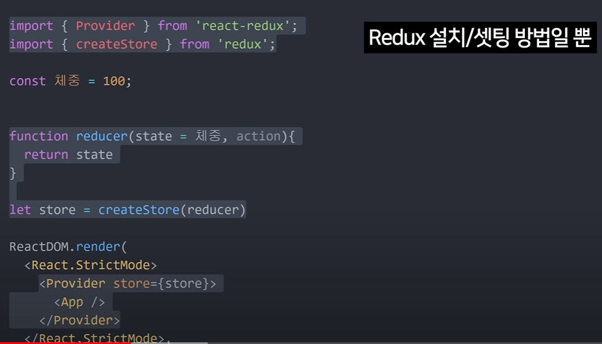

```
npm run build : 배포를 위한 친구
npx serve -s build : build 폴더 내에 있는 index.html을 열어줌 
```


**리액트는 사용자 정의 태그를 사용한다!**

```javascript
const _mode = useState('WELCOME');
// mode = _mode[0]
// setMode = _mode[1]
// _mode의 두번째 인자는 첫번째 인자 값을 변경시켜주는 함수!!

=> 간단히 쓰기 위해서
const [mode, setMode] = useState();
```


const [value, setValue] = useState(PRIMITIVE);

==> PRIMITIVE 에 사용 가능한 친구들: **string, number, bigint, boolean, undefined, symbol, null**

const [value, setValue] = useState(Object);

==> Object에 사용 가능한 친구들: **object, array**

object의 경우 ==> newValue = {...value} : value의 복제

array의 경우 ==> newValue = [...value] : value의 복제

여기서 newValue를 변경하고 setValue(newValue)로 원본을 변경한다


# useReducer: react Hooks

ex> 거래내역: state, 은행: Reducer

-> 철수가 거래내역인 state를 변경해달라고 요구하는 것: Dispatch

-> "만원 출금 해주세요" 라는 요구 내용 : Action

```
Dispatch(Action) --> Reducer(State, Action) :: state가 update!
```


# Redux

- props 쓰기 귀찮을때: redux=state 보관

다음은 redux 제작자가 강요한 코드들




- 상태, 관리가 용이: state 수정 방법 또한 같이 state들과 같이 보관 -> state에 버그가 잡혀도 추적이 편

```javascript
import React, { useState } from 'react';
import './style.css';
import { createStore } from 'redux';
// Provider: component: state값을 누구에게 전달할지 정하는 친구(provider로 감싸진 애들만 전달이 가능)
// useSelector: 어떤 state의 값을 사용하고 싶은지 고를때 사용
// useDispatch: state값의 변경을 꾀할때 사용
// connect: 재사용성에 필요한 친구(어려운 편)
import { Provider, useSelector, useDispatch, connect } from 'react-redux';

// currentState: 현재 값
// action: 어떤 변화를 가할지
function reducer(currentState, action) {
  // default 값을 설정하기
  if (currentState === undefined) {
    return {
      number: 1,
    };
  }
  // 복제본을 가져와서 변경하기
  const newState = { ...currentState };
  if (action.type === 'PLUS') {
    newState.number++;
  }
  return newState;
}

const store = createStore(reducer);
export default function App() {
  return (
    <div id="container">
      <h1>Root</h1>
      <div id="grid">
        {/* store={store} 는 필수 인자 */}
        <Provider store={store}>
          <Left1></Left1>
          <Right1></Right1>
        </Provider>
      </div>
    </div>
  );
}
function Left1(props) {
  return (
    <div>
      <h1>Left1 </h1>
      <Left2></Left2>
    </div>
  );
}
function Left2(props) {
  console.log('2');
  return (
    <div>
      <h1>Left2 : </h1>
      <Left3></Left3>
    </div>
  );
}
function Left3(props) {
  console.log('3');
  const number = useSelector((state) => state.number);
  return (
    <div>
      <h1>Left3 : {number}</h1>
    </div>
  );
}
function Right1(props) {
  return (
    <div>
      <h1>Right1</h1>
      <Right2></Right2>
    </div>
  );
}
function Right2(props) {
  return (
    <div>
      <h1>Right2</h1>
      <Right3></Right3>
    </div>
  );
}
function Right3(props) {
  const dispatch = useDispatch();
  return (
    <div>
      <h1>Right3</h1>
      <input
        type="button"
        value="+"
        onClick={() => {
          dispatch({ type: 'PLUS' });
        }}
      ></input>
    </div>
  );
}

```

